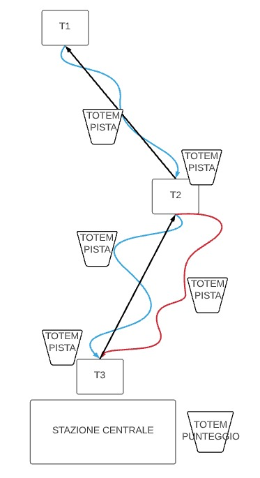
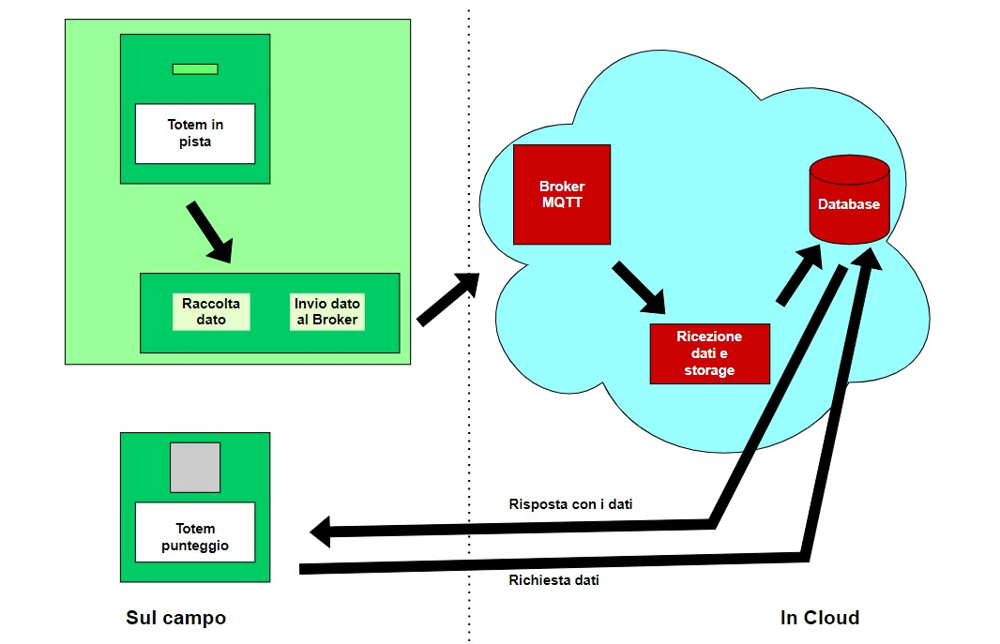

# Protocolli.IoT

## COMPONENTI

|Cognome | Nome | E-mail|
|:-:|:-:|:-:|
| Scapolan | Davide | davide.scapolan@stud.tecnicosuperiorekennedy.it |
| Fontana | Marika | marika.fontana@stud.tecnicosuperiorekennedy.it |

## DIAGRAMMI
|||
|-|-|

## UTILIZZO MQTT

### CONNESSIONI
#### Totem pista
	clientId = "lettore*N*"
	cleanSession = false
	lastWillTopic = "RFID/pista*M*/lettore*N*/Will"
	lastWillQos = 1
	lastWillMessage = "exit"
	lastWillRetainFlag = false
	keepAlive = 60

### TOPICS

	RFID/pista*M*/lettore*N*/Will
		CleanSession = false
		QoS = 1
		
	RFID/pista*M*/lettore*N*/lettura
		CleanSession = false
		QoS = 2

### PAYLOAD

#### RFID/pista\*M*/lettore\*N*/Will:
	"exit"

#### RFID/pista\*M*/lettore\*N*/lettura:
	{
		date: "2022-01-27T12:19:15.364Z",
		user: *codice Skipass*
	}

## SICUREZZA

Per quanto riguarda la sicurezza, considerando che i totem si connettono via SIM, il livello Network non è sicuramente praticabile; a livello di Transport è possibile criptare la comunicazione e ottenere una maggiore protezione.

## AUTENTICAZIONI

Ogni client ha delle credenziali proprie che vengono utilizzate per far riconoscere il client dal broker e conferire autorizzazioni specifiche ad ognuno.

## AUTORIZZAZIONI

###	Lettura
L'applicazione lato server ha accesso a RFID/#.

###	Scrittura
I totem in pista hanno accesso a RFID/pista\*M*/lettore\*N*/Will e RFID/pista\*M*/lettore\*N*/lettura

